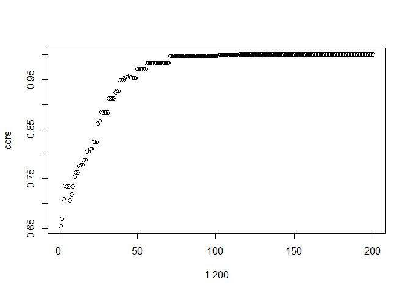

<!-- README.md is generated from README.Rmd. Please edit that file -->

# AbmNI

<!-- badges: start -->
<!-- badges: end -->

The goal of AbmNI is to …

## Installation

You can install the development version of AbmNI from
[GitHub](https://github.com/) with:

``` r
# install.packages("devtools")
devtools::install_github("JochemTolsma/AbmNI")
```

## Example

This is a basic example which shows you how to solve a common problem:

``` r
library(AbmNI)
library(plotly)
#> Loading required package: ggplot2
#> Warning: package 'ggplot2' was built under R version 4.4.1
#> 
#> Attaching package: 'plotly'
#> The following object is masked from 'package:ggplot2':
#> 
#>     last_plot
#> The following object is masked from 'package:stats':
#> 
#>     filter
#> The following object is masked from 'package:graphics':
#> 
#>     layout
```

### Generating some toy data

``` r
seeds <- sample(2345:34567, 1000, replace=FALSE) #CAUTION, DO NOT OVERWRITE IF YOU WANT TO REPLICATE RUNS
#opinions <- seq(-1 ,1, length.out=10)
#opinions <- round(runif(10, min=-1, max=1), 1)
opinions <- c( -0.1 , 1.0 , 0.4 , 0.4 ,-0.5 , 0.4 , 0.7 , 0.7 ,-0.3,  0.6)
#groups <- rep(c(-1,1), 5 )
groups <- c(-1,  1, -1,  1, -1,  1, -1,  1, -1,  1)
net1 <- matrix(sample(c(0,1),100, replace=TRUE), nrow=10, ncol =10)
diag(net1) <- 0
```

### simulations

Lets do 50 simulations. Only the opinions matter in the dissimilarity
scores. Thus, H=1.

``` r
nsim <- 50
results <- list()
for (i in 1:nsim) {
  #NOTE: IF MANY RUNS SET KEEP TO FALSE AND VERBOSE TO FALSE
  results[[i]] <- ABM_NI(opinions=opinions, groups=groups, iter=1000, keep=FALSE, verbose=FALSE, seed = seeds[i], H = 1)
}
```

### results

Retrieve the results. First have a look at how many runs polarized. We
use the sd as indicator of polarization.

``` r
df_sd <- do.call("rbind", lapply(results, FUN = function(x) x[[1]]$sd))
table(round(df_sd,1))
#> 
#>   0 0.6 0.8   1 
#>  21  19   8   2
```

So it seems we have four different type of outcomes. Let us have a look
at the opinions in the end:

``` r
df_opinions <- do.call("rbind", lapply(results, FUN = function(x) x[[1]]$opinions))
print("consensus")
#> [1] "consensus"
df_opinions[round(df_sd,1) == 0, ][1,] #consensus (check if also consensus at extreme!)
#>  [1] 0.2031849 0.2031849 0.2031849 0.2031849 0.2031849 0.2031849 0.2031849
#>  [8] 0.2031849 0.2031849 0.2031849

print("all extreme, 1 outlier extremist")
#> [1] "all extreme, 1 outlier extremist"
df_opinions[round(df_sd,1) == 0.6, ][1,] 
#>  [1]  0.9999816  0.9999709  1.0000000  0.9999844 -1.0000000  0.9999694
#>  [7]  0.9999844  0.9999734  0.9999709  0.9999699

print("all extreme, 2 outlier extremist")
#> [1] "all extreme, 2 outlier extremist"
df_opinions[round(df_sd,1) == 0.8, ][1,] 
#>  [1]  1  1  1  1 -1  1  1  1 -1  1

print("all extreme, 3 outlier extremist: polarization")
#> [1] "all extreme, 3 outlier extremist: polarization"
df_opinions[round(df_sd,1) == 1, ][1,] 
#>  [1] -1  1  1  1 -1  1  1  1 -1  1
```

### rerun specific simulations

Check out run 1

``` r
#thus rerun with same seed
results <- ABM_NI(opinions=opinions, groups=groups, iter=200, verbose=FALSE, seed = seeds[1], H = 1, keep=TRUE)
df_opinions <- do.call("rbind", lapply(results, FUN = function(x) x$opinions))
df_opinions <- round(df_opinions, 1)

#plot development
matres <- matrix(NA, nrow=200, ncol=length(seq(-1, 1, 0.1)))
for (i in 1:200) {
  op <- factor(df_opinions[i,], levels = seq(-1, 1, 0.1))
  prop <- prop.table(table(op)) #relative frequency across all possible values
  matres[i,] <- prop
}

time <- 1:200 #check the iter argument of ABM_NI
opinion <- seq(-1, 1, 0.1)

# Create surface plot
p <- plot_ly(x = time, y = opinion, z = t(matres), type = "surface") |> 
  layout(title = 'Relative frequency of opinions',
         scene = list(camera=list(eye = list(x=-2, y=-0.5, z=0.64))))
#naturally the interactive plot is much nicer, but does not work in README :-(
```


Check out run 2

``` r
#thus rerun with same seed
results <- ABM_NI(opinions=opinions, groups=groups, iter=200, verbose=FALSE, seed = seeds[2], H = 1, keep=TRUE)
df_opinions <- do.call("rbind", lapply(results, FUN = function(x) x$opinions))
df_opinions <- round(df_opinions, 1)

#plot development
matres <- matrix(NA, nrow=200, ncol=length(seq(-1, 1, 0.1)))
for (i in 1:200) {
  op <- factor(df_opinions[i,], levels = seq(-1, 1, 0.1))
  prop <- prop.table(table(op)) #relative frequency across all possible values
  matres[i,] <- prop
}

time <- 1:200 #check the iter argument of ABM_NI
opinion <- seq(-1, 1, 0.1)

# Create surface plot
p <- plot_ly(x = time, y = opinion, z = t(matres), type = "surface") |>
  layout(title = 'Relative frequency of opinions',
         scene = list(camera=list(eye = list(x=-2, y=-0.5, z=0.64))),
         legend = list(
          xaxis = list(title = 'time')  
         ))
          
```


# Example 2

Put egos in a queue.

Lets do 50 simulations. Only the opinions matter in the dissimilarity
scores. Thus, H=1.

``` r
nsim <- 50
results <- list()
#because we now iterate over the queue, trim down the iter. 
for (i in 1:nsim) {
  #NOTE: IF MANY RUNS SET KEEP TO FALSE AND VERBOSE TO FALSE
  results[[i]] <- ABM_NI(opinions=opinions, selectType=2, groups=groups, iter=100, keep=FALSE, verbose=FALSE, seed = seeds[i], H = 1)
}
```

### results

Retrieve the results. First have a look at how many runs polarized. We
use the sd as indicator of polarization.

``` r
df_sd <- do.call("rbind", lapply(results, FUN = function(x) x[[1]]$sd))
table(round(df_sd,1))
#> 
#>   0 0.6 0.8   1 
#>  17  20   8   5
```

random ego selection or putting in a waiting line, does not seem to
matter

# Example 3

weights also determined by group.

``` r
cor.test(opinions, groups)
#> 
#>  Pearson's product-moment correlation
#> 
#> data:  opinions and groups
#> t = 2.3293, df = 8, p-value = 0.04821
#> alternative hypothesis: true correlation is not equal to 0
#> 95 percent confidence interval:
#>  0.01015105 0.90364531
#> sample estimates:
#>       cor 
#> 0.6357143
```

We see a moderate correlation between opinions and groups. thus
polarization should become more likely.

``` r
nsim <- 50
results <- list()
for (i in 1:nsim) {
  #NOTE: IF MANY RUNS SET KEEP TO FALSE AND VERBOSE TO FALSE
  results[[i]] <- ABM_NI(opinions=opinions, groups=groups, iter=1000, keep=FALSE, verbose=FALSE, seed = seeds[i], H = 0.5)
}
```

### results

``` r
df_sd <- do.call("rbind", lapply(results, FUN = function(x) x[[1]]$sd))
table(round(df_sd,1))
#> 
#> 1.1 
#>  50
```

All maximum polarization. Lets have a better look!

Do we see alignment?

``` r
results <- ABM_NI(opinions=opinions, groups=groups, iter=200, verbose=FALSE, seed = seeds[15], H = 0.5, keep=TRUE)
df_opinions <- do.call("rbind", lapply(results, FUN = function(x) x$opinions))
df_opinions <- round(df_opinions, 1)

cors <- NA
for (i in 1:200) {
  cors[i] <- cor(groups, df_opinions[i,])
}
plot(1:200, cors)
```



Yup!

<!---
What is special about using `README.Rmd` instead of just `README.md`? You can include R chunks like so:
&#10;
``` r
summary(cars)
#>      speed           dist       
#>  Min.   : 4.0   Min.   :  2.00  
#>  1st Qu.:12.0   1st Qu.: 26.00  
#>  Median :15.0   Median : 36.00  
#>  Mean   :15.4   Mean   : 42.98  
#>  3rd Qu.:19.0   3rd Qu.: 56.00  
#>  Max.   :25.0   Max.   :120.00
```
&#10;You'll still need to render `README.Rmd` regularly, to keep `README.md` up-to-date. `devtools::build_readme()` is handy for this.
&#10;You can also embed plots, for example:
&#10;
&#10;In that case, don't forget to commit and push the resulting figure files, so they display on GitHub and CRAN.
&#10;--->
